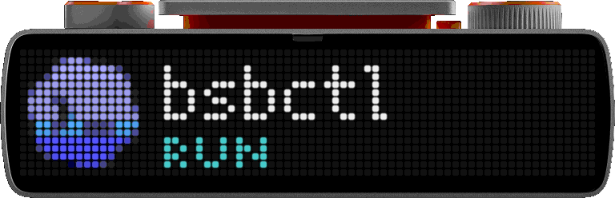

# bsbctl

`bsbctl` connects BUSY Bar to local tools on macOS. It shows Calendar events, Codex activity and quota, and Mac resource usage.

## See it on the device

These previews use mock data. See [preview generation](docs/maintainers/development.md#preview-generation) for how they are made.

<p align="center">
  <strong>Local Mac Calendar</strong><br>
  
</p>

<p align="center">
  <strong>Codex</strong><br>
  
</p>

<p align="center">
  <strong>Codex quota</strong><br>
  
</p>

<p align="center">
  <strong>Mac Resources</strong><br>
  
</p>

## Install

On macOS, connect a reachable BUSY Bar and install the latest stable release:

```sh
curl -fsSL https://github.com/lxdb/bsbctl/releases/latest/download/install.sh | sh
```

The installer verifies the download, installs `bsbctl` in `~/.local/bin`, starts a per-user service, and asks which apps to enable. No app is selected by default. Add `~/.local/bin` to `PATH` if needed.

Release binaries are ad-hoc signed, not Developer ID signed or notarized. macOS may block them under its Gatekeeper policy.

Check the installation:

```sh
bsbctl status
```

A JSON response confirms that the daemon responds. Check the device readiness field separately. For authentication, app selection, or setup failures, see [Getting started](docs/getting-started.md).

## Documentation

| Task | Guide |
| --- | --- |
| Choose and configure apps | [Built-in apps](docs/apps.md) |
| Use the device controls | [Device and attention](docs/device-and-attention.md) |
| Troubleshoot the service | [Operations](docs/operations.md) |
| Find a command | [CLI reference](docs/reference/cli.md) |
| Build a plugin | [Plugin authoring](docs/plugin-authoring.md) |
| Contribute or release | [Maintainer documentation](docs/README.md#maintain-the-project) |

See the [documentation index](docs/README.md) for all guides and references.

## Support and license

Report bugs through [GitHub Issues](https://github.com/lxdb/bsbctl/issues). Use the [security policy](SECURITY.md) for vulnerability reports.

Licensed under [GNU GPL version 3 or later](LICENSE). Before redistribution, review [NOTICE](NOTICE), [third-party notices](THIRD_PARTY_NOTICES.md), and [`LICENSES/`](LICENSES/).
