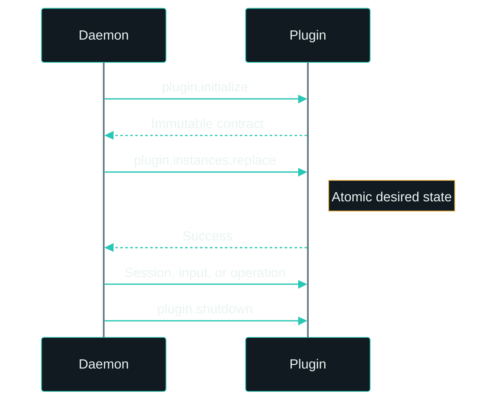

# bsbctl plugin protocol 1.0

This document defines the normative daemon-to-plugin contract. The Go validators are the executable authority. `schema.json` describes structural shape but cannot express byte limits, Unicode-control rejection, or every cross-field relationship.

## Compatibility

Protocol 1.0 is an exact contract. Both peers advertise the string `"1.0"` during `plugin.initialize`; there is no version negotiation. A plugin process serves one immutable plugin definition and zero or more daemon-supplied instances within the 1 MiB message limit.

## Transport and lifecycle

The transport is bidirectional newline-delimited JSON-RPC 2.0 over the inherited private socket on file descriptor 3. A message is at most 1 MiB. Request IDs are positive canonical decimal strings and must be unique while in flight; the SDK emitter allocates them monotonically, but a receiver does not retain global ID history. Canceling an in-flight request sends the reserved `rpc.cancel` notification with `{ "id": "<request-id>" }`; the receiver cancels the matching handler context and ignores cancellation for an unknown or already completed ID. A full frame is sent even if its caller observes cancellation immediately afterward; its canonical late response is ignored. Partial, malformed, noncanonical, unwritten, future, and otherwise unsolicited responses are protocol errors. A plugin implementation must continue reading the socket while handlers run so that cancellation can be observed.

Requests and notifications may contain the top-level metadata object `"bsbctl": { "deadline_unix_milliseconds": 1893456000000 }`. The field is a positive signed 64-bit integer counting milliseconds since the Unix epoch; the value shown is illustrative. When metadata is present, it must be a non-null object with this field and no unknown, duplicate, or case-aliased fields. The receiver uses the earlier of this deadline and its existing local context deadline; an elapsed deadline produces an already-canceled handler context. Without metadata, the handler inherits the local context's deadline. The SDK emits this metadata for calls whose context has a deadline. Responses must not contain `bsbctl` metadata. Unknown or duplicate top-level envelope fields are protocol errors.

The lifecycle is:

Initialization establishes exact core, plugin, and protocol identity before plugin construction. `plugin.instances.replace` supplies the complete desired instance set and is atomic from the handler's perspective. While replacement is in progress, state-changing host requests normally fail with `not_ready`; atomic execution admission instead fails with `session_generation_mismatch` because the exact session generation cannot safely cross the replacement boundary. Calls admitted before replacement finish against the old generation before it retires. Each instance contains plugin-owned configuration, resolved secrets, and optional checkpoint data. Enablement and channel policy are daemon-owned and never cross this wire.

Every instance-bound request and callback carries an `InstanceRef` containing both `id` and a nonzero `generation`. A generation identifies one exact incarnation; activity from a retired or unknown generation is rejected. Repeating an identical desired set is idempotent.

## Method inventory

Daemon-to-plugin methods invoke the plugin lifecycle:

| Method | Kind | Purpose |
| --- | --- | --- |
| `plugin.initialize` | Request | Establish exact identity, protocol, contract, and handler. |
| `plugin.instances.replace` | Request | Atomically replace the complete enabled instance set. |
| `plugin.session.start` | Request | Start one exact core-owned interactive session. |
| `plugin.session.input` | Request | Deliver one typed FIFO input and receive its disposition. |
| `plugin.session.end` | Request | End one exact session idempotently. |
| `plugin.operation.invoke` | Request | Invoke one immutable declared query or command. |
| `plugin.health` | Request | Read current bounded plugin health. |
| `plugin.shutdown` | Request | Stop and join plugin-owned work. |

Plugin-to-daemon methods request core-owned effects:

| Method | Kind | Purpose |
| --- | --- | --- |
| `host.observation.publish` | Request | Replace one exact-generation observation. |
| `host.observation.withdraw` | Request | Remove one observation identity. |
| `host.checkpoint.save` | Request | Durably replace one bounded non-secret checkpoint. |
| `host.session.execution.begin` | Request | Obtain the final grant for one irreversible session effect. |
| `host.session.complete` | Request | Complete one exact foreground session. |
| `host.log` | Notification | Send one bounded structured diagnostic event. |
| `host.metric` | Notification | Attempt one explicitly lossy metric event. |
| `rpc.cancel` | Notification | Cancel the handler context for one in-flight request ID. |

## Plugin contract and payload ownership

An initialization result declares immutable execution modes, channels, and operation descriptors. Execution modes are `resident` and `interactive`. Operation descriptors declare `query` or `command`; invocation requests name the operation but do not repeat its kind.

Only instance configuration, checkpoint data, session action payloads, and operation request/result payloads are plugin-owned JSON objects. They must be objects, not arbitrary JSON values, and are limited to 64 KiB. A plugin may own an optional `schema_version` inside its checkpoint object; core validates only the bounded object and exact instance identity, persists it durably and in isolation, and returns failure unless the persistence outcome is committed. Core does not interpret or migrate plugin checkpoint fields. Session input and presentations use the protocol-owned typed shapes below.

## Session input

`plugin.session.input` is a request/response callback bound to an exact instance reference and session token. It carries a positive diagnostic sequence, UTC `occurred_at`, and exactly one input variant: a button (`ok`, `back`, or `start`; `press` or `release`) or a nonzero encoder delta. The response is exactly `{ "disposition": "consumed" }` or `{ "disposition": "not_consumed" }`; an empty object, unknown value, or malformed response is a callback failure. Delivery is bounded FIFO with one callback in flight. Ordinary callbacks, including Back press, have a two-second deadline. OK and Start presses, which may request atomic execution, have a seven-second host deadline that contains the built-ins' five-second effect budget and terminal cleanup. Callback error, timeout, transport loss, invalid response, or queue overrun invalidates the exact session, and ambiguous inputs are never retried.

Only Back press uses its result synchronously for presentation ownership. The daemon gives the exact foreground session first refusal. `consumed` preserves plugin handling and causes no dismissal cooldown. `not_consumed`, a stale or absent session, timeout, process loss, callback error, or malformed response executes one daemon fallback: close the foreground and launcher, clear the physical presentation, tombstone only the exact dismissed observation revision, and start one non-configurable process-local 30-second gate. Non-critical presentation is suppressed during the gate; critical actionable attention bypasses it. Back release produces no second action. The gate is not persisted, does not award delivery or scheduling credit, and reevaluates fresh observations when it expires.

## Atomic session execution

`host.session.execution.begin` asks core for the final permission to perform one irreversible effect for the exact foreground session. The request is `{ "instance": { "id": string, "generation": positive integer }, "session_token": string }`. A plugin calls it only after all reversible validation and user confirmation, immediately before the effect. Success means that exact session became `executing`; it does not grant physical display or input ownership.

Core grants the request only while the authenticated plugin, instance generation, and token are the active interactive foreground. A critical actionable observation that acquires foreground first cancels the session, so a later request fails closed. Once execution is granted, critical attention cannot cancel the in-progress effect and remains eligible for reevaluation after `host.session.complete`. Plugins must not perform an effect after a rejected grant, and they must not repeat an already-triggered external effect solely because later checkpoint persistence failed.

## Observations and presentation

An observation is keyed by exact instance generation, channel, key, and positive revision. It records disposition, one of the exact impacts `low`, `normal`, `notable`, or `critical`, a stable reason code, and UTC observation/update timestamps. An unresolved observation (`snapshot`, `notable`, or `actionable`) has a future `valid_until` and exactly one visual presentation: `scene` or `busy_timer`. It may also have one bounded audio cue. A `resolved` observation has no validity deadline or presentation. Snapshot disposition is foreground/on-demand state and is not proactively eligible for ambient presentation.

A scene contains 1 through 64 uniquely identified elements. Every element declares `display` (`front` or `back`), nonnegative coordinates that fit that display (`72x16` front, `160x80` back), and exactly one payload. Colors are `#RRGGBBAA`. Alignment, when present, is one of `top_left`, `top_mid`, `top_right`, `mid_left`, `center`, `mid_right`, `bottom_left`, `bottom_mid`, or `bottom_right`.

| Element | Required semantics |
| --- | --- |
| text | UTF-8 value up to 512 bytes; required font (`tiny`, `small`, `normal`, `condensed`, `bold`, `large`, `extra_large`, or `global`); optional color, alignment, unsigned 32-bit width, and marquee |
| image | package-path or stock asset reference |
| animation | package-path or stock asset reference and optional loop flag |
| rectangle | positive signed 32-bit width and height plus color |
| countdown | positive `ends_at_unix_seconds`, `show_hours` (`when_non_zero` or `always`), color, and optional alignment; count-up/time-since is unsupported |

Marquee speed is `pixels_per_minute`; delays are milliseconds. An image or animation asset reference contains exactly one of `package_path` or `stock_name`. A package path is the canonical package-relative `source` authenticated by that plugin's manifest and never exposes its content-derived physical device path. A stock name is a validated firmware basename: images end in `.image`, animations in `.anim`, and audio in `.snd`; the element kind must match. Package audio is unavailable in the first release, so an audio cue requires a `stock_name`. A busy timer uses `theme`, the safe lowercase firmware theme-directory name, and may last at most 24 hours. Firmware may accept an unknown safe theme name and render its `busy` fallback; snapshot/readback reports the requested configuration and is not proof of the theme actually rendered. Audio carries a future UTC expiry no later than the observation expiry; visual success is confirmed independently if the best-effort audio write fails.

## Time, omission, validation, and errors

Timestamps are RFC 3339 UTC values. Optional scalar and timestamp fields are omitted when zero. Identifiers are nonempty UTF-8 strings without control characters and are at most 128 bytes unless a narrower field rule applies. Unknown object fields and malformed union combinations are invalid.

JSON-RPC uses the standard protocol errors plus exactly one bsbctl domain code, `-32000`, whose required safe data is `{ "kind": ... }`. Stable domain kinds are `invalid_argument`, `not_ready`, `generation_conflict`, `session_not_active`, `session_canceled`, and `session_generation_mismatch`. The three session kinds are the only denials for atomic execution: respectively the exact session is not the current interactive foreground, critical ownership canceled it, or its runtime generation retired. A generic callback failure uses standard `-32603` without private data. A `-32000` response with missing or malformed data, an unknown kind, or any other private server code is a protocol violation and terminates the peer. Private causes remain local and must not appear in error messages or wire data.
