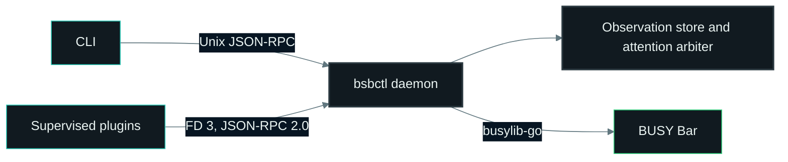

# Architecture

The daemon owns configuration, plugins, attention decisions, and all BUSY Bar writes. CLI commands and plugins send requests to it; plugins never write to the device directly.

The daemon stores plugin observations, selects one presentation, and writes it through busylib-go.

## Responsibilities

| Component | Responsibility |
| --- | --- |
| CLI | Parse commands and return JSON results. |
| `daemonrun` | Construct components, start workers, and coordinate shutdown. |
| `DesiredState` / `LiveState` | Commit configuration and track accepted runtime state. |
| `Reconciler` | Apply configuration to plugins, secrets, checkpoints, and assets. |
| `SessionCoordinator` / `SessionRuntime` | Track foreground sessions and execute their effects. |
| `PolicyResolver` / attention engine | Determine eligibility and select a presentation. |
| `PackageOps` / `pluginhost.Manager` | Manage package changes and supervise plugin processes. |
| `RuntimeStatus` | Read diagnostics without changing runtime state. |
| Plugins | Read providers, validate instance settings, and publish observations. |
| BUSY Bar | Render output and report physical input. |

Required dependencies are supplied at construction. Each state owner has one responsibility; the reconciler and attention engine share the same policy resolver and session state.

## Lifecycle

Startup recovers interrupted installation work, loads configuration, constructs the runtime, and reconciles the initial desired state. The control socket accepts work only after that completes.

Shutdown stops new work, cancels and joins workers, stops plugins with deadlines, flushes diagnostics, clears device output, and releases device ownership. Shutdown errors retain the initiating cause.

## Data and input

Plugins atomically accept a complete enabled instance set, then publish expiring observations. Core validates each observation against its generation and policy before selecting it. Input is bound to the exact foreground session, so stale input cannot act on a newer request.

The plugin protocol is exactly `1.0`, framed with JSON-RPC 2.0. See the [specification](../protocol/v1/spec.md) for the wire contract and [Compatibility](compatibility.md) for stored-data versions.

Implementation starts in [`internal/daemonrun`](../../internal/daemonrun/).
